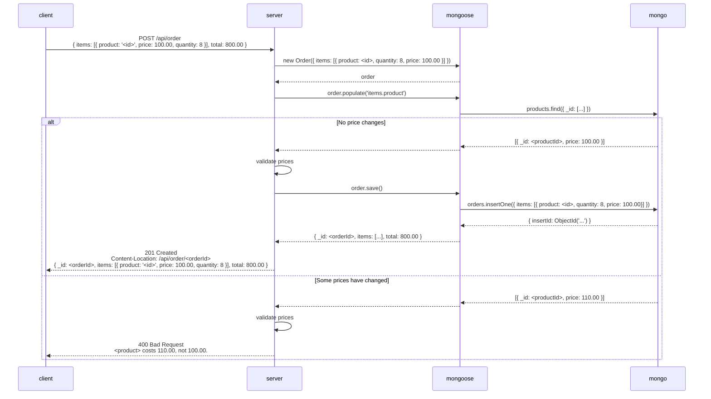

### API Endpoints

| Method   | URL                                            | Request Payload                                                       | Response                                                         | Semantics                                       | Required Privilege                  | Comments                                                                                     |
| -------- | ---------------------------------------------- | --------------------------------------------------------------------- | ---------------------------------------------------------------- | ----------------------------------------------- | ----------------------------------- | -------------------------------------------------------------------------------------------- |
| `GET`    | `/api/auth`                                    | N/A                                                                   | &bull;&nbsp;200 if successful. &bull;&nbsp;404 if not logged in. | Get the current user.                           | N/A                                 | The response shall not include a `Set-Cookie` header.                                        |
| `PUT`    | `/api/auth`                                    | `username`, `password`                                                |                                                                  | Log in.                                         | N/A                                 | The response shall include a `Set-Cookie` header.                                            |
| `DELETE` | `/api/auth`                                    |                                                                       |                                                                  | Log out.                                        | N/A                                 | The response shall include a `Set-Cookie` header to clear the cookie set by `PUT /api/auth`. |
| `PUT`    | `/api/user/:userid`                            | `email`, `password`, `firstName`, `lastName`, `city`, `streetAddress` | Sign up (create a new user account).                             | N/A                                             | `userId` is user's ID Card # (ת.ז.) |                                                                                              |
| `POST`   | `/api/category`                                | `name`                                                                |                                                                  | Create a new product category.                  | `admin`                             |                                                                                              |
| `GET`    | `/api/category/all`                            |                                                                       |                                                                  | Get all the categories.                         | `user`                              | The response shall not include the products arrays.                                          |
| `GET`    | `/api/category/:categoryId`                    |                                                                       |                                                                  | Get details for the specified category.         | `user`                              | The response shall not include the products array.                                           |
| `POST`   | `/api/category/:categoryId/product`            | `name`, `price`, `imageUrl`                                           |                                                                  | Create a new product in the specified category. | `admin`                             |                                                                                              |
| `GET`    | `/api/category/:categoryId/product/all`        |                                                                       |                                                                  | Get all the products in the specified category. | `user`                              |                                                                                              |
| `GET`    | `/api/category/:categoryId/product/:productId` |                                                                       |                                                                  | Get details for the specified product.          | `user`                              |                                                                                              |
| `DELETE` | `/api/category/:categoryId/product/:productId` |                                                                       |                                                                  | Delete the specified product.                   | `admin`                             |                                                                                              |
| `POST`   | `/api/order`                                   |                                                                       |                                                                  | Check out (create a new order).                 | `user`                              |                                                                                              |
| `GET`    | `/api/order/:orderId`                          |                                                                       |                                                                  | Get details for the specified order.            | `admin`                             |                                                                                              |

### Order Flow

