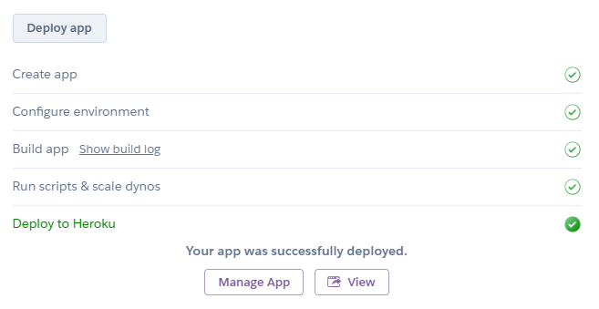

## Deploy your own instance of this app on Heroku

1. Click the following button:

    

2. Customize the deployment parameters to your liking.

    
    
3. Click **Deploy app**.
4. Wait for the build to finish.

    

5. Click **View** to use the app.
